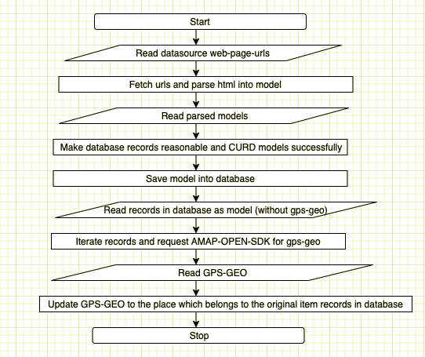
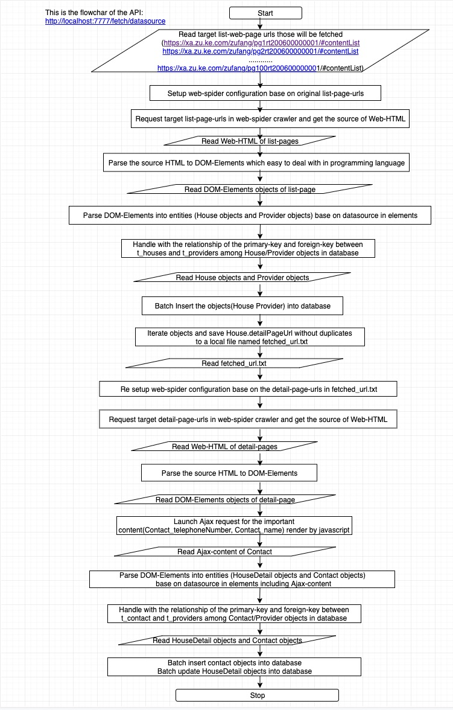
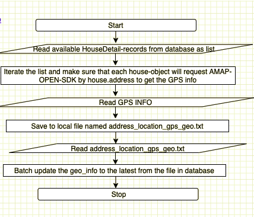
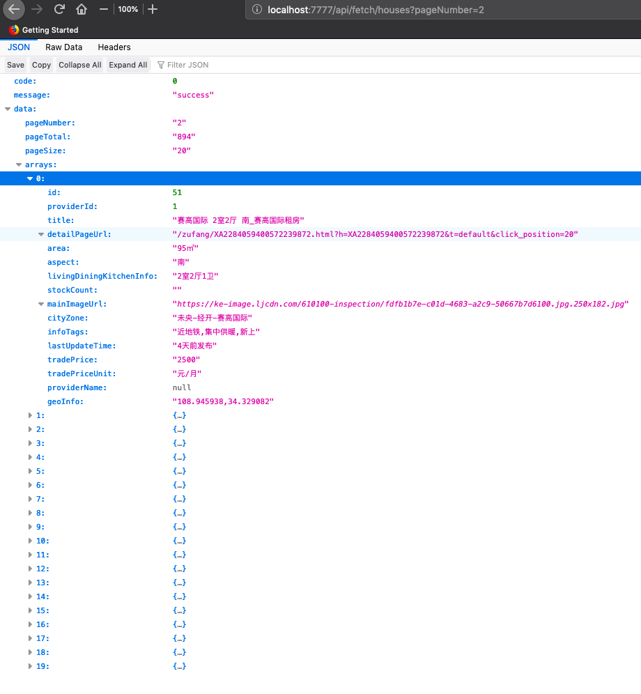

## Dwell Main FlowChart and APIs.  

+ Dwell-server MainFlow:  

+ Fetch Original DataSource :  [http://localhost:7777/fetch/crawlers]()  

  

+ Fetch Coordinates based on Addresss-Text in AMAP-OPEN-SDK : [http://localhost:7777/fetch/coordinates]()

+ Fetch Paging of list API : [http://localhost:7777/api/fetch/houses?pageNumber=2]() 

