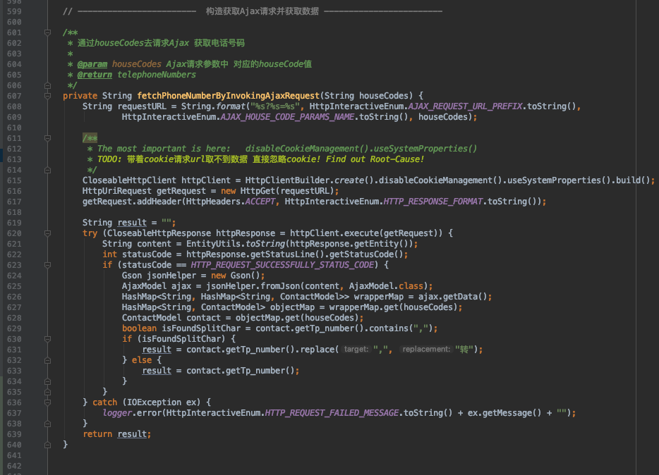
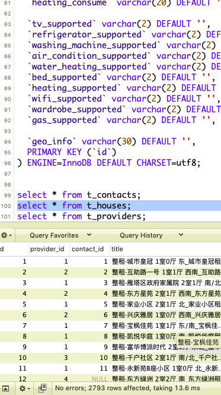

## Construct the Ajax-Request for dynamic-content on Web-Page.  

&nbsp;&nbsp;&nbsp;&nbsp;Some target content were rendered by JavaScript, so I have to using Ajax to fetch the target with the extra effort.  
&nbsp;&nbsp;&nbsp;&nbsp;For instance, the telephone-number is not repsonsed by server-side directly, let's Ajax it by ourselves.  
&nbsp;&nbsp;&nbsp;&nbsp;I've fetched 3030 pages in web-spider and only got 2793 records including the dirty-records in the end, which means that I've constructed at least 2793 times Ajax-Requesting when API invoked. A little bit worried about the performance.    

