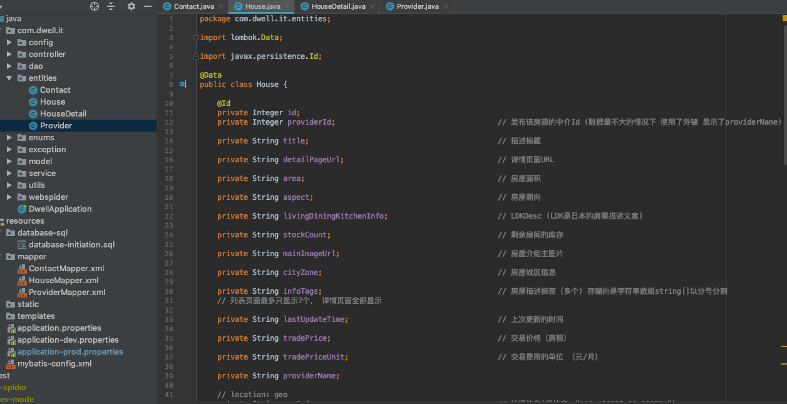
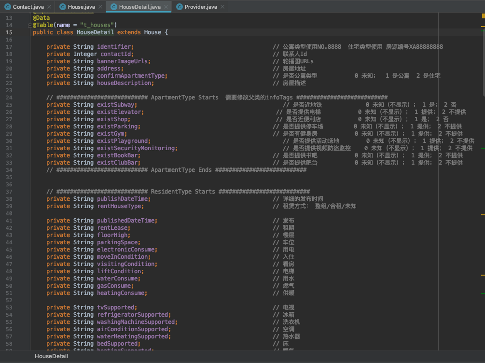
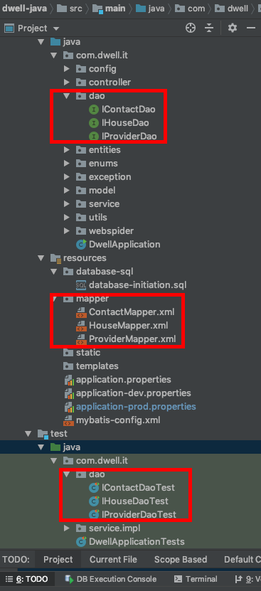
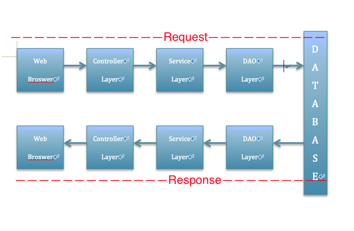

### 1. Fetch  
&nbsp;&nbsp;&nbsp;&nbsp;[贝壳租房](https://xa.ke.com/) may shares the largest marketing in real estate websites in China and it has millions of real estate info on its platform. I'd like to fetch the data-source from right [here](https://xa.zu.ke.com/zufang) .  

- 1.1 Analyse the web-elements on data-source website in browser.  
&nbsp;&nbsp;&nbsp;&nbsp;&nbsp;&nbsp; I prefer FireFox that can help developers saving much time, by the way, google-chrome is a better option. At first, let's right click the mouse after the target website loaded, then select <b>[Inspect Element]</b> from the sheet-menu, and the window page will be rendered by source code of HTML-elements in Inspector-View. Thanks to the high-lighted color on Inspector-View, we can easily locate every text-element on the source code while just following the content which on the website.  
<p><p>
	<div align="center">  </div>
<p><p>
	<div align="center">  </div>
<p><p>


- 1.2 Using Web-Spider to Fetch.  
&nbsp;&nbsp;&nbsp;&nbsp;&nbsp;&nbsp; Python will be an excellent way for handing with web-crawler/spider in recently, but I've never token python for the project as backend programming language before. Considering in time-consuption and python-starter, I chose java as the programming language for backend and [Crawler4j](https://github.com/yasserg/crawler4j) as web-spider in the end.  


- 1.3 Format the value of all target elements.  
&nbsp;&nbsp;&nbsp;&nbsp;&nbsp;&nbsp; Different types of result values will be reformat in String-Type during DOM-Formating, because there are still serval steps for data persistence in database.


- 1.4 Locate the target DOM.  
&nbsp;&nbsp;&nbsp;&nbsp;&nbsp;&nbsp; DOM is Document-Object-Model and I chose [Jsoup](https://jsoup.org/) as the DOM-Parsing-Utils in project.  


### 2. Parse DOM  
&nbsp;&nbsp;&nbsp;&nbsp;Keep constructing entities (models) which based on HTML-Element of DOM-Tags on WebPage in programming language, so that we can map the entities into database easily in ORM-Framework later.   
 &nbsp;&nbsp;&nbsp;&nbsp;Watch out the rule of <b>"DON'T REPEAT YOURSELF"</b> and make the encapsulation among the classes. 
<p><p>
	<div align="center">  </div>
<p><p>
	<div align="center">  </div>
<p><p>

### 3. Save  
&nbsp;&nbsp;&nbsp;&nbsp;We can get the final entities in Step 2 and program with MyBatis in order to provide data persistence and query services in database. It means that we can only focus on the operations of programming-language-layer and we don't need to take care of the data persistence by ourselves.  

- 3.1 Setup database environment  
  &nbsp;&nbsp;&nbsp;&nbsp;&nbsp;&nbsp; Unix/Linux is much better for developers for handling with the command-line during the development. My IDE is based on Mac and I'm highly recommend you [HomeBrew](https://brew.sh/) as your management utils of command-line on Mac because everything in homebrew is done as simple and easy as it does.

  - 3.1.1 Install MySQL on local host.  
  &nbsp;&nbsp;&nbsp;&nbsp;&nbsp;&nbsp;
  	```
      brew install mysql@5.7      						//  Install MySQL in '@' which between the name(mysql) and version(5.7)  
  	```

  - 3.1.2 Setup Database connection in configuration file.    
&nbsp;&nbsp;&nbsp;&nbsp;&nbsp;&nbsp; Locate the configuration file in project which named <b>application.properties</b> and setup the database connection including <b>driver, url, username, password, caches </b> for database.  Let's begin to program with mybatis.
<p><p>
	<figure class="third">
		 
		 <p></p>
		
	</figure>
<p><p>  


- 3.2 Setup enitities including mapper.xml in MyBatis way and seperate layers of DAO, Service and Controller.    
  &nbsp;&nbsp;&nbsp;&nbsp;&nbsp;&nbsp;It seems like doing a reversed DOM-Parsing. Map the structure, class-info into entity mapper-files (xml-file) for  DAO-Layer and then implement the Service-Layer based on DAO-Layer. <b>We can put the most if-conditions in Service instead of putting in Controller</b>. 

<p><p>
	<figure class="third">
		 
		
	</figure>
<p><p>  


<p><p>
	<div align="center">  </div>
<p><p>  
  
