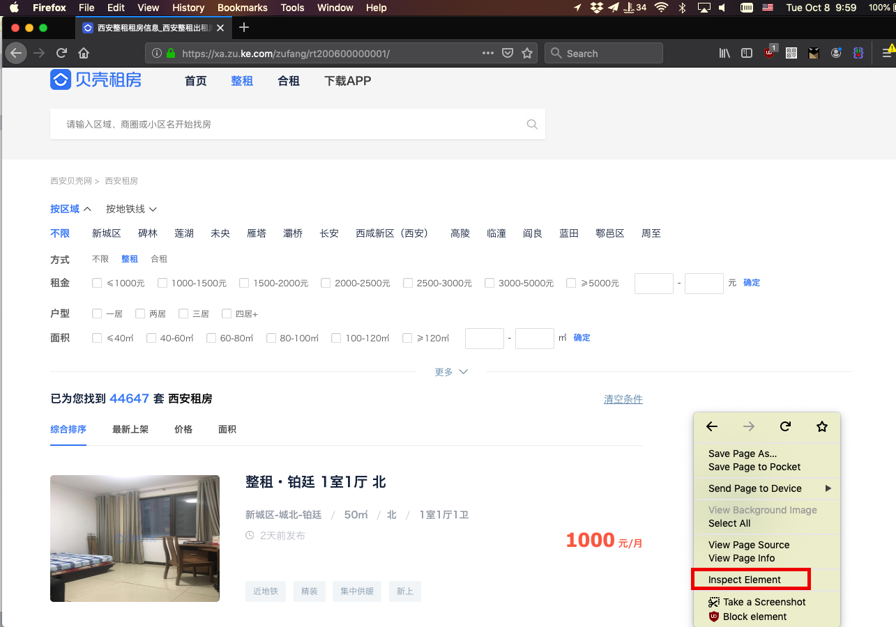
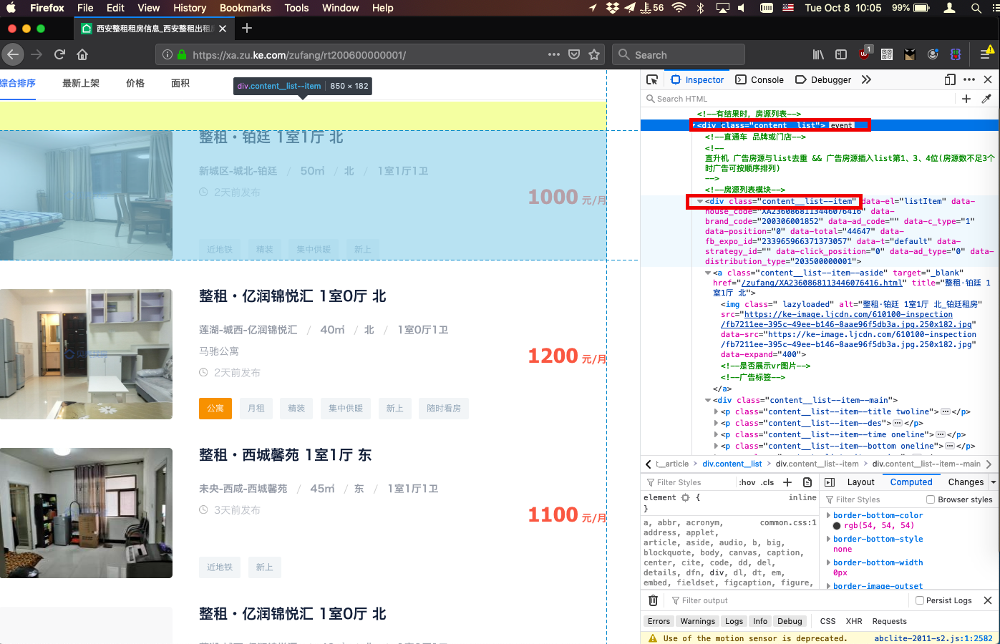

# Just Dwell It.  
&nbsp;&nbsp;&nbsp;&nbsp; Dwell is an application which can make it easier to find the good places to rent and to dwell in Xi'an City according to a few steps on <b>Data Visualization</b>. Now I'm going to code for learning new skills, sharing tips, and providing values for the city in my way. I hope you'll gonna like this.  

## Make the Plan.   
+ There're 5 main parts in the project. <b>Fetch</b> DataSource + <b>Format</b> Data + <b>Save</b> Records + <b>Query</b> Records + <b>Display</b> Result.  
+ Manage the development in [Trello](https://trello.com)  including push-notifications from Continuous Integration server.
+ Base on Java [Spring Boot](https://spring.io/projects/spring-boot) as backend. &nbsp; [Amazon Corretto 8](https://aws.amazon.com/blogs/opensource/amazon-corretto-no-cost-distribution-openjdk-long-term-support/)  (An OpenJDK-8 for avoiding the affairs of copyright in legal)  
+ Base on [React.js](https://reactjs.org/) as frontend for displaying.  

### 1. Fetch
&nbsp;&nbsp;&nbsp;&nbsp;[贝壳租房](https://xa.ke.com/) may shares the largest marketing in real estate websites in China and it has millions of real estate info on its platform. I'd like to fetch the data-source from right [here](https://xa.zu.ke.com/zufang) .  

- 1.1 Analyse the web-elements on data-source website in browser.  
&nbsp;&nbsp;&nbsp;&nbsp;&nbsp;&nbsp; I prefer firfox that can help developers saving much time, by the way, google-chrome is a better option. At first, let's right click the mouse after the target website loaded, then select <b>[Inspect Element]</b> from the sheet-menu, and the window page will be rendered by source code of HTML-elements in Inspector-View. Follow the content which on the website, we can easily locate every displaying element on the source code.  

- 1.2 Using Web-Spider to Fetch.  
&nbsp;&nbsp;&nbsp;&nbsp;&nbsp;&nbsp; Python will be an excellent way for handing with web-crawler/spider in recently, but I've never token python for the project as backend programming language before. Considering in time-consuption and python-starter, I chose java as the programming language as backend and [Crawler4j](https://github.com/yasserg/crawler4j) as web-spider in the end.  

- 1.3 Format the value of all target elements.  
&nbsp;&nbsp;&nbsp;&nbsp;&nbsp;&nbsp; Different types of result values will be reformat in String-Type during DOM-Formating, because there are still serval steps for data persistence in database.

- 1.4 Parse the target DOM.  
&nbsp;&nbsp;&nbsp;&nbsp;&nbsp;&nbsp; DOM is Document-Object-Model and I chose [Jsoup](https://jsoup.org/) as the DOM-Parsing-Utils in project.

#### Tips:  

